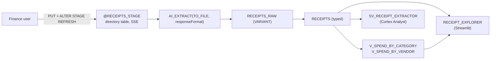

# Expense Rodeo -- Architecture

## Objects

| Object | Type | Role |
|--------|------|------|
| `RECEIPTS_STAGE` | Stage (directory table, SSE) | Lands mixed PDF/JPG/PNG/TIFF receipts |
| `SP_RECEIPT_EXTRACT_ALL` | Procedure | Refreshes directory, calls `AI_EXTRACT` per file, re-populates raw + fact |
| `RECEIPTS_RAW` | Table (VARIANT) | Audit trail for every `AI_EXTRACT` response |
| `RECEIPTS` | Table (typed) | Fact table joined/filtered by dashboard and semantic view |
| `V_SPEND_BY_CATEGORY`, `V_SPEND_BY_VENDOR` | Views | Pre-aggregated rollups for the dashboard |
| `SV_RECEIPT_EXTRACTOR` | Semantic View | Cortex Analyst natural-language entry point |
| `RECEIPT_EXPLORER` | Streamlit | File-preview, KPI, and aggregate UI |

## Why two tables?

`RECEIPTS_RAW` keeps the full VARIANT response so re-shaping the typed fact
table (e.g., adding a new field) never re-bills Cortex. The typed `RECEIPTS`
table is what dashboards and the semantic view consume.

## Data flow

1. User PUTs receipts into `@RECEIPTS_STAGE`.
2. `CALL SP_RECEIPT_EXTRACT_ALL()` runs `ALTER STAGE REFRESH`, then
   `AI_EXTRACT` on every `.pdf`, `.jpg`, `.jpeg`, `.png`, `.tif`, `.tiff`.
3. Responses land in `RECEIPTS_RAW` (VARIANT), then are MERGEd into `RECEIPTS`
   as typed columns.
4. Streamlit + Cortex Analyst read `RECEIPTS` and the rollup views.
